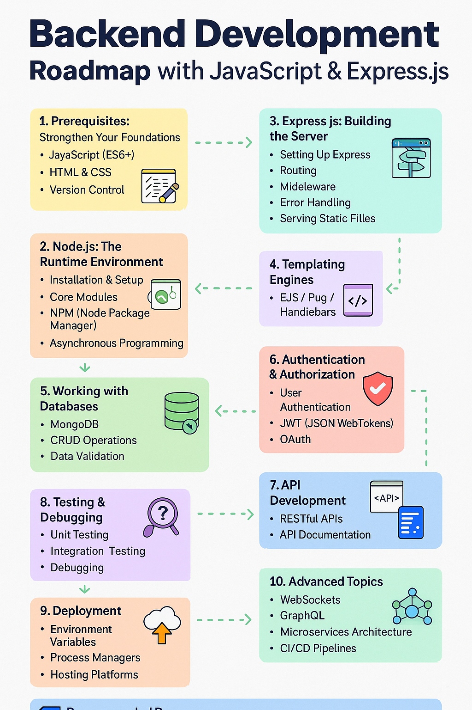
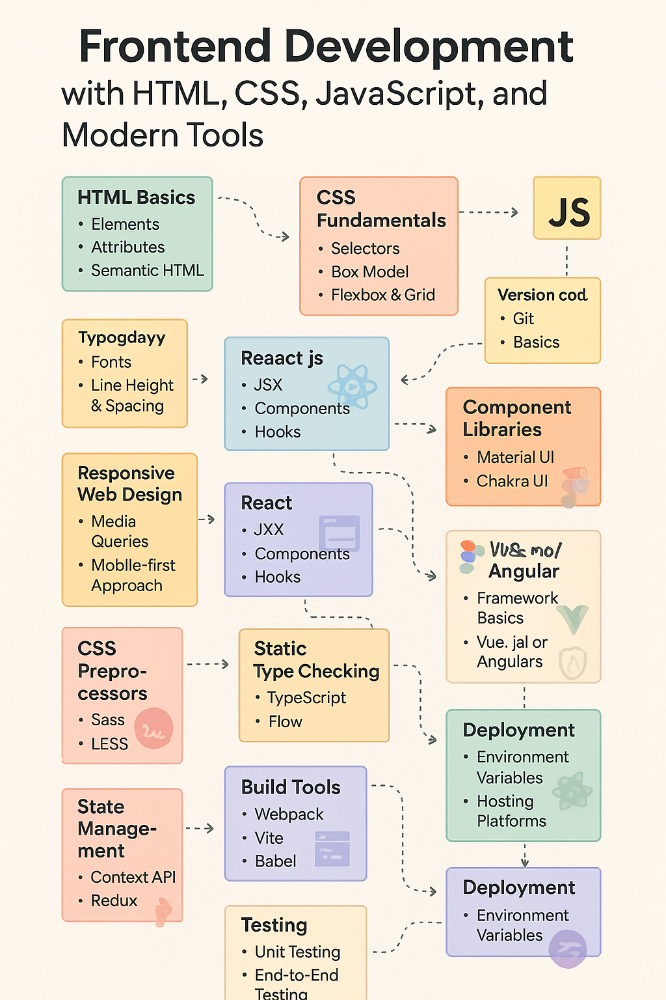

# Full Stack Web Development Roadmap

This repository provides a complete roadmap to becoming a proficient full-stack web developer using modern tools and technologies including HTML, CSS, JavaScript, React.js, Node.js, and Express.js.

## 📁 Files

- `FullstackRoadmap.txt`: Overview of the entire full stack learning journey.
- `Frontend.txt`: Roadmap for frontend development with React, styling, and modern tooling.
- `Backend.txt`: Roadmap for backend development using Node.js, Express.js, MongoDB, and APIs.
- 
# Fullstack Development Roadmap

## Backend Roadmap

## Frontend Roadmap

## 🧠 Skills Covered

### Frontend
- HTML, CSS, JS (ES6+)
- React.js, Material UI, Chakra UI
- State Management (Redux, Context API)
- Responsive Design
- Webpack, Vite, Babel

### Backend
- Node.js, Express.js
- MongoDB
- Authentication (JWT, OAuth)
- REST APIs
- Testing & Debugging
- Deployment

## 🚀 Deployment Topics
- Hosting platforms
- Environment variables
- CI/CD basics

## Contribution
Feel free to fork, clone, and improve the roadmap. Pull requests are welcome!

---

> Built with passion for web development.
